# plant-ai: industrial AI for chemical dosing and effluent treatment

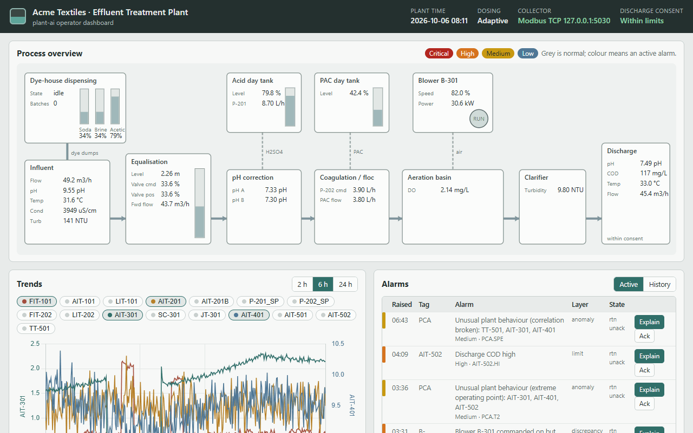

plant-ai is a working model of the automation and data stack around a textile mill's effluent treatment plant
(ETP) and its dye-house chemical dispensing station. A seeded plant simulator acts as the PLC and serves its tags
over **Modbus TCP**. A collector polls them into a **historian**, an **ISA-18.2-style alarm system** with sensor-health
checks and **PCA anomaly detection** raises incidents, **adaptive dosing control** cuts chemical and energy use,
and a **guarded maintenance assistant** explains alarms from the plant's SOPs. Daily compliance and shift reports
come straight from the historian.

It is built for people who work where process plants meet data: automation and controls engineers, OT and IIoT
data engineers, and manufacturing analytics teams. The process knowledge comes from commissioning automated
chemical-dispensing systems for textile dyeing and automating chemical dosing in effluent treatment plants.

The mill, Acme Textiles, and all its data are fictional.

## Key features

- **Plant simulator**: equalisation, pH correction, coagulation and flocculation, aeration, clarifier and discharge,
  plus the dye-house dispensing station whose spent dye baths drain to the plant. 35 tags, seeded and repeatable.
- **Seven planted faults with ground truth**: pH probe drift, dosing pump clogging, chemical tank running low,
  influent shock load, blower failure, stuck valve and sensor flatline.
- **Modbus TCP** PLC server and collector (pymodbus), with range-checked setpoint writes.
- **Historian** in SQLite: narrow time-series table keyed by tag and time, plus alarms, incidents and notes.
- **Alarm management**: limits with deadbands and delays, rate of change, command-versus-feedback discrepancy,
  designed and flood suppression, ISA-18.2 alarm states, first-out incidents with severity.
- **Sensor health and anomaly detection**: flatline, probe disagreement, stuck feedback, range limits, and PCA
  (Hotelling T-squared and SPE) with the top contributing tags.
- **Dosing optimisation**: fixed-rate baseline against a soft-sensor feed-forward strategy with PI trims and DO
  control, measured on chemical use, energy and time out of the discharge consent.
- **Maintenance assistant**: BM25 over 16 SOPs (optional embeddings), an LLM step that explains the alarm, suggests
  checks and drafts a handover note, and guards against invented readings, missing citations and any command to
  equipment. Without an API key it answers from retrieval and a template.
- **Reports**: daily discharge-compliance report and shift report with ISA-18.2 alarm KPIs.
- **Dashboard**: a high-performance HMI style page with a plant mimic, trends, alarms, incidents, the assistant
  and a simulator training panel.

## Screenshots

| Process overview (mimic) | Assistant with guards |
|---|---|
| 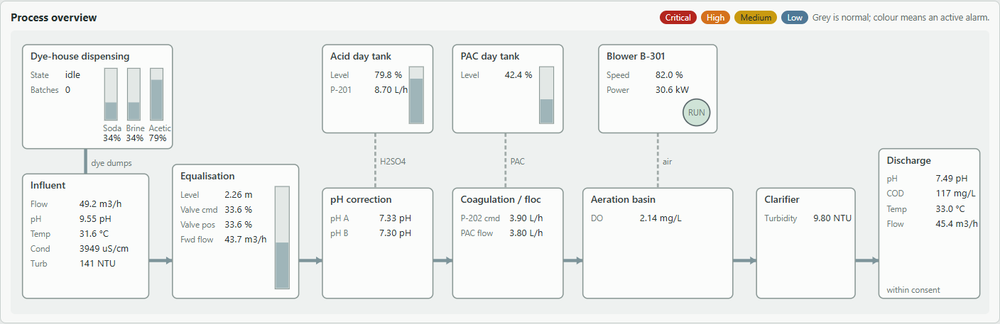 | 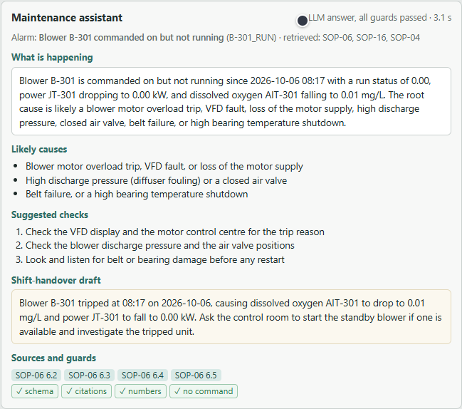 |

| Alarms | Incidents |
|---|---|
| 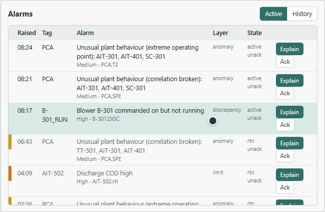 | 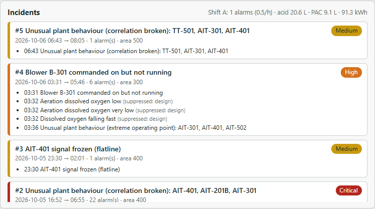 |

| Daily compliance report | Shift report |
|---|---|
| 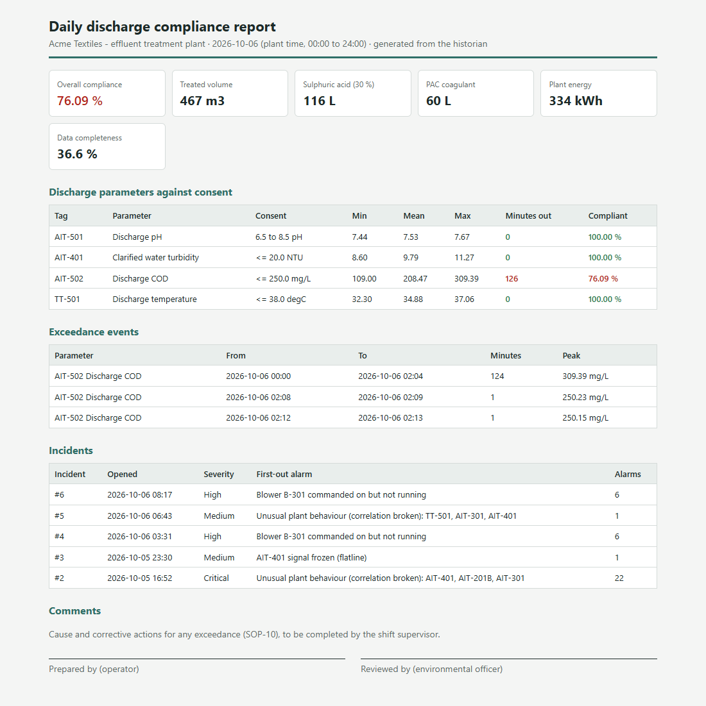 | 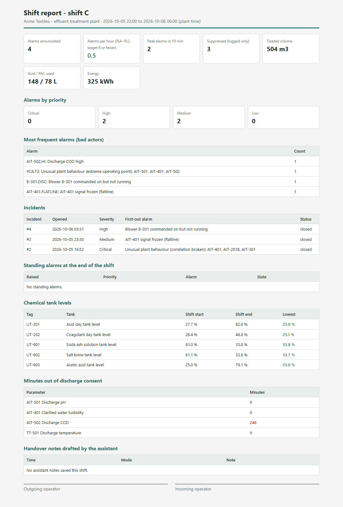 |

| Modbus TCP read of every tag | Evaluation |
|---|---|
| 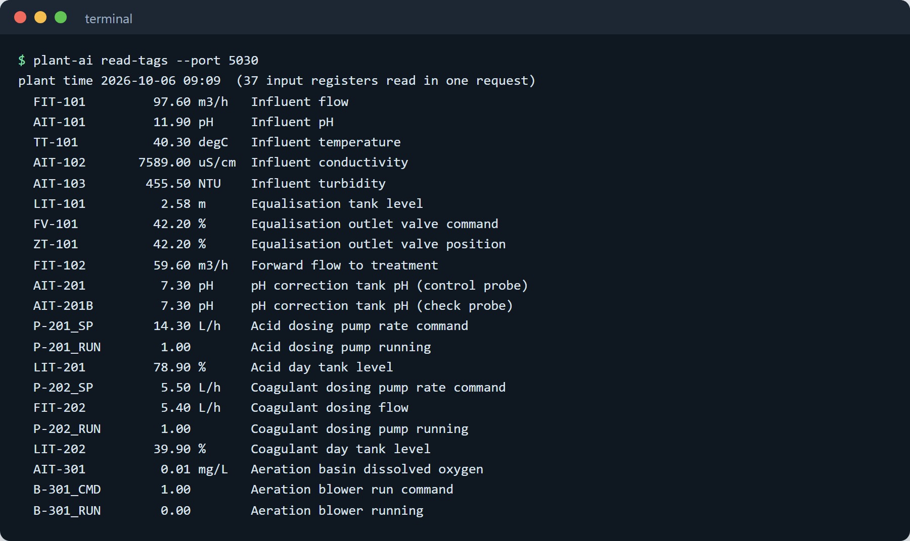 | 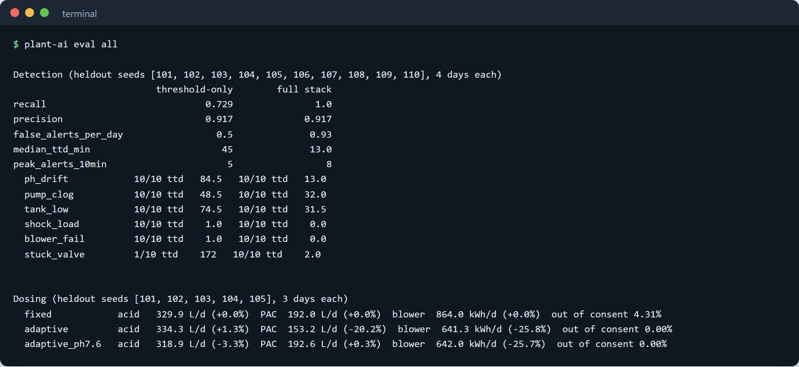 |

The full dashboard: [docs/screenshots/dashboard.png](docs/screenshots/dashboard.png).

## The plant in plain words

Dyeing cotton with reactive dyes uses soda ash, salt and dyes at high temperature. When a batch finishes, the
spent dye bath goes to drain: hot, alkaline (pH 9 to 12), coloured, salty and full of organic load. The effluent
treatment plant cleans it before it is discharged.

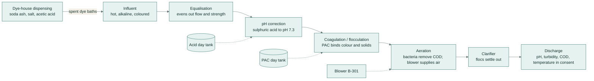

1. **Equalisation** holds a few hours of effluent so a single dye dump is diluted before treatment.
2. **pH correction** neutralises the alkalinity with acid, because coagulation works best near neutral.
3. **Coagulation and flocculation** add polyaluminium chloride (PAC), which gathers colour and particles into flocs.
4. **Aeration** feeds air so bacteria can eat the dissolved organic load (COD).
5. **The clarifier** lets the flocs settle; the clear water is checked against the discharge consent.

### Where automation and AI save chemicals, time and manpower

| Where | What the system does | Measured here |
|---|---|---|
| Coagulant dosing | Dose follows the estimated load instead of a fixed rate sized for the worst dump | 20 % less PAC on held-out runs |
| Aeration | Blower speed follows dissolved oxygen instead of running flat out | 26 % less blower energy |
| Discharge compliance | Dosing follows dye dumps, so the plant stays inside the consent | 4.3 % of time out of consent with fixed dosing, 0 % adaptive |
| Fault finding | Sensor-health checks and PCA catch faults that limits miss, earlier | all 70 held-out faults detected, median 13 min vs 45 min |
| Alarm handling | Designed suppression and first-out incidents keep the alarm list readable | peak 8 alarms in any 10 min |
| Operator time | The assistant gathers the evidence, finds the SOP and drafts the handover note | answer in about 2.3 s |
| Reporting | Compliance and shift reports are generated from the historian | no manual transcription |

## Architecture

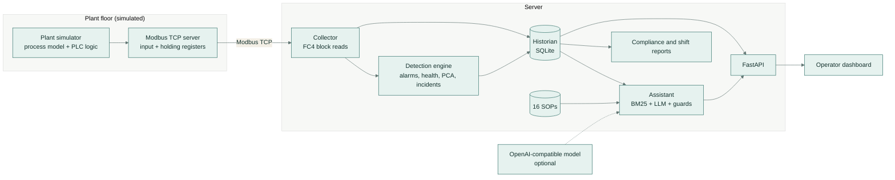

The assistant and the dashboard read the historian; neither has a write path to the PLC. Setpoints can only be
written over Modbus (`plant-ai write-setpoint`), and the server refuses values outside each setpoint's range.

## How it works

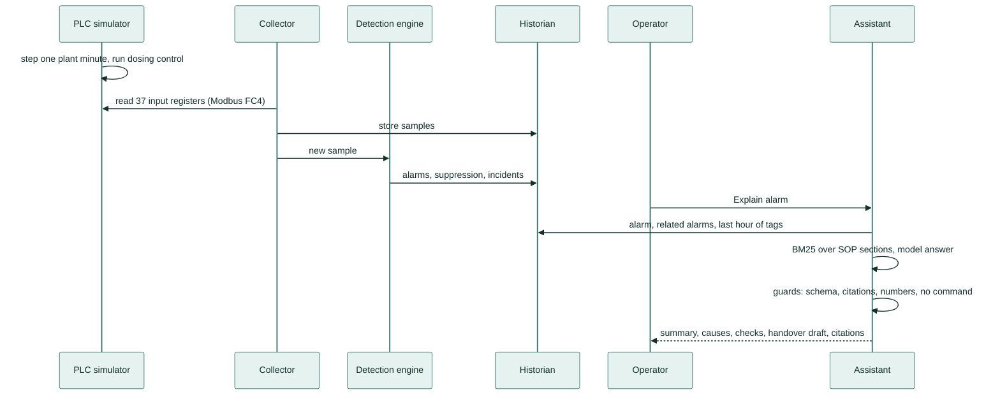

1. **Simulate.** Every tick the simulator advances one plant minute: dye batches, dumps, mixing, titration,
   coagulation, aeration kinetics and any planted fault. The dosing controller reads only measured tags.
2. **Serve.** The Modbus TCP server exposes plant time and 35 tags as scaled 16-bit input registers and 4 setpoints
   as holding registers ([register map](docs/modbus-register-map.md)).
3. **Collect.** The collector reads the whole block in one request, decodes it and stores it when the plant
   clock has moved on. Connection loss is recorded and retried with back-off.
4. **Detect.** The same engine used by the evaluation evaluates limits, rate of change, discrepancies, sensor
   health and the PCA statistics, applies designed and flood suppression and groups alarms into incidents
   ([alarm management](docs/alarm-management.md)).
5. **Explain.** For a selected alarm the assistant collects the evidence, retrieves SOP sections, and either
   fills a template or asks the model; model answers that fail a guard are replaced by the template
   ([assistant](docs/assistant.md)).
6. **Report.** Compliance and shift reports are rendered from the historian on demand.

The process model, control strategies and faults are described in [docs/process-model.md](docs/process-model.md).

## Results

All numbers come from `plant-ai eval all` and are stored in [eval/results](eval/results/summary.md). The data is
synthetic with ground truth. Limits, windows, the PCA factor, controller gains, SOP texts and the retrieval query
were set on the tuning seeds and scenarios; the held-out seeds and scenarios below were not used for tuning.

### Fault detection (held-out seeds 101-110, 10 runs of 4 days, 70 planted faults)

| Metric | Threshold-only alarms | Alarms + sensor health + PCA |
|---|---|---|
| Faults detected | 51/70 (0.729) | 70/70 (1.0) |
| Alert precision | 0.917 | 0.917 |
| False alerts per day | 0.5 | 0.93 |
| Median time to detect | 45 min | 13 min |
| Peak annunciated alerts in 10 min | 5 | 8 |

| Fault | Threshold-only: detected, median time | Full stack: detected, median time |
|---|---|---|
| pH probe drifting | 10/10, 84.5 min | 10/10, 13 min |
| Coagulant dosing pump clogging | 10/10, 48.5 min | 10/10, 32 min |
| Chemical day tank running low | 10/10, 74.5 min | 10/10, 31.5 min |
| Influent shock load | 10/10, 1 min | 10/10, 0 min |
| Aeration blower failure | 10/10, 1 min | 10/10, 0 min |
| Equalisation valve stuck | 1/10, 172 min | 10/10, 2 min |
| Sensor flatline | 0/10 | 10/10, 29 min |

An alert counts as a detection when it is raised inside a fault's window on one of the fault's related tags (PCA
alerts count by time). Every other annunciated alert counts as false, including real process excursions such as
a natural COD peak. The full stack finds every fault and finds it sooner, at the price of about one extra false
alert every two days (37 against 20 over 40 days).

### Dosing (held-out seeds 101-105, 5 runs of 3 days)

| Strategy | Acid L/day | PAC L/day | Blower kWh/day | Time out of consent |
|---|---|---|---|---|
| Fixed-rate baseline (on/off acid, fixed PAC, blower at 100 %) | 329.9 | 192.0 | 864.0 | 4.31 % |
| Adaptive, pH setpoint 7.3 | 334.3 (+1.3 %) | 153.2 (-20.2 %) | 641.3 (-25.8 %) | 0 % |
| Adaptive, pH setpoint moved to 7.6 | 318.9 (-3.3 %) | 192.6 (+0.3 %) | 642.0 (-25.7 %) | 0 % |

Compliance is measured on the model's true discharge values. Adaptive dosing uses about the same acid as the
on/off baseline at the same average pH, a fifth less coagulant and a quarter less blower energy, and keeps the
discharge inside the consent while the fixed rates let turbidity through during dye dumps. Moving the pH
setpoint up saves acid but costs coagulant, because PAC works best near neutral pH.

### Maintenance assistant (31 labelled alarm scenarios: 21 tuning, 10 held-out)

Each scenario plants one fault, runs detection, and asks about the first alarm the fault raises, 15 minutes later.
The label is the SOP for the root cause.

| Mode | Correct SOP (all / held-out) | Guard pass rate | Median latency | Tokens in / out | Cost |
|---|---|---|---|---|---|
| Retrieval (BM25) + template | 31/31 / 10/10 | 100 % (template) | no model call | - | 0 |
| BM25 + embeddings (hybrid) | 31/31 / 10/10 | - | - | - | - |
| LLM + guards (`gemini-flash-lite-latest`) | 31/31 / 10/10 | 31/31 | 2.3 s (max 3.1 s) | 59,905 / 12,546 | about USD 0.011 |

On these scenarios retrieval alone already picks the right SOP, so the model adds the written explanation and the
handover note rather than accuracy. The guards are exercised by unit tests with invented readings, missing or
foreign citations, claims of having operated equipment and control verbs in checks; all are rejected. The model
answers are cached in `eval/llm-cache/`, so `plant-ai eval assistant --llm --offline` reproduces the LLM row
without a key or any model call. CI never calls a model.

## Tech stack

| Area | Tools |
|---|---|
| Simulation and analytics | Python 3.11, NumPy (process model, PCA by SVD) |
| Industrial protocol | Modbus TCP with pymodbus 3.15 (server with device action hook, async client) |
| Historian | SQLite in WAL mode |
| API and UI | FastAPI, Uvicorn, plain JavaScript, inline SVG mimic, Chart.js |
| Assistant | BM25 (own implementation), optional embeddings, OpenAI-compatible client (Gemini by default) |
| Quality | pytest, ruff, GitHub Actions |
| Docs tooling | Mermaid, Playwright-driven screenshots and GIF |

## Setup

Python 3.11 or newer.

```bash
python -m venv .venv
source .venv/bin/activate            # Windows: .venv\Scripts\activate
pip install -e ".[dev]"              # one command to set up
```

### Configuration

All settings are environment variables; nothing secret is stored in files.

| Variable | Purpose |
|---|---|
| `AI_API_KEY` | Key for the model; without it the assistant uses retrieval + template |
| `AI_BASE_URL` | OpenAI-compatible endpoint (default: Gemini's) |
| `AI_MODEL` | Chat model (default `gemini-flash-lite-latest`) |
| `AI_EMBED_MODEL` | Embedding model for hybrid retrieval (default `gemini-embedding-001`) |
| `AI_MIN_INTERVAL_S` | Minimum seconds between live model calls (default 2.5) |
| `PLANT_AI_HOME` | Where the historian, caches and reports are written (default: the repo folder) |

## Usage

```bash
plant-ai demo                        # one command to run the demo: http://127.0.0.1:8000
```

`demo` backfills 26 hours of history (with a pump clog, a shock load, a flatline and a blower trip), then starts
the Modbus TCP PLC simulator on port 5020, the collector and the dashboard. The plant runs at 60 times real time.
Use the training panel to plant a fault, then press **Explain** on the alarm it raises.

The pieces can also run on their own:

```bash
plant-ai modbus-server --port 5020           # PLC simulator only
plant-ai collect --port 5020                 # collector: Modbus TCP -> historian + detection
plant-ai dashboard --http 8000               # dashboard over an existing historian
plant-ai read-tags --port 5020               # read and decode every tag
plant-ai write-setpoint AIC-301_SP 2.5       # write a setpoint (range-checked by the server)
plant-ai simulate --hours 48 --faults random # write history straight into the historian
plant-ai explain 12 --llm                    # ask the assistant about alarm 12
plant-ai report compliance --date 2026-10-06 # HTML reports into reports/
plant-ai report shift --previous
plant-ai eval all                            # detection, dosing and assistant (retrieval) evaluations
plant-ai eval assistant --llm --offline      # LLM + guards from the cached answers
```

To record the demo GIF and screenshots against a running demo: `node scripts/record_demo.mjs http://127.0.0.1:8000`.

## Project structure

```text
plant_ai/
  tags.py                 tag register, Modbus addresses, discharge consent
  sim/                    process model, dosing controllers, planted faults
  protocols/              Modbus TCP server (PLC) and collector
  historian.py            SQLite historian
  detect/                 alarm rules, detection engine, PCA model
  assistant/              SOP knowledge base (kb/), retrieval, evidence, guards, LLM client
  reports.py              compliance and shift reports
  web/                    FastAPI app and the static dashboard
  live.py                 demo runner (simulator + Modbus + collector in one loop)
  eval/                   detection, dosing and assistant evaluations
  cli.py                  plant-ai command
eval/                     labelled assistant scenarios, results, cached model answers
docs/                     design notes, screenshots, demo GIF
scripts/record_demo.mjs   GIF and screenshot recorder
tests/                    unit and integration tests
```

## Tests and CI

```bash
ruff check . && ruff format --check .
python -m pytest -q                  # 45 tests
```

The tests cover the simulator and each planted fault, the alarm engine (deadbands, delays, discrepancy,
suppression, flood handling, incidents, PCA), a real Modbus TCP round trip from server to collector to historian
including a refused out-of-range write, the assistant's retrieval and guards (with a fake model), the reports and
the API. The GitHub Actions workflow runs lint, the tests and the no-model evaluations on every push.

## Design notes

- [Process model, control strategies and faults](docs/process-model.md)
- [Alarm management and detection](docs/alarm-management.md)
- [Maintenance assistant and guards](docs/assistant.md)
- [Modbus TCP register map](docs/modbus-register-map.md)

## Scope

The plant model is a teaching-grade simulation with plausible magnitudes, not a design tool, and all results are
on synthetic data. The assistant's SOPs were written for this plant, which makes retrieval easier than on a real
document set; the evaluation reports that plainly.

## Licence

MIT. Copyright (c) 2026 Samiul Huda. See [LICENSE](LICENSE).
